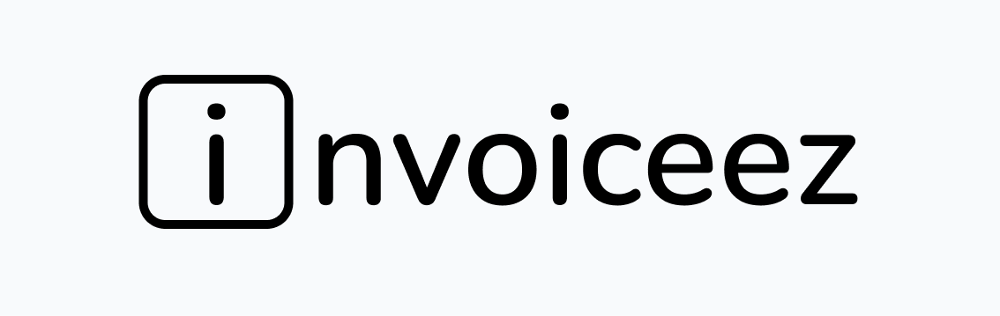

<p align="center">
  
</p>

# Invoiceez

Invoiceez is a web app for easily generating clean, uncluttered invoices.

> *Currenty version: v0.2.0*


## Features

- save and reuse your businesses and customers
- keep historical invoice information if you later change a customer or business
- allows for multiple discounts (fixed and percentage)
- formatting / localization for `USD`, `ZAR`, and `EUR` currencies

## Tech Stack

- **Backend:** .NET 9, `QuestPDF`
- **Database:** Postgres 18
- **Frontend:** Nuxt v.4 with `shadcn-vue`, OpenAPI-generated client

## Roadmap

There is no official roadmap, but some future features include:

- duplicating invoice items / discounts
- editing customers
- changing invoice templates (potentially with user-supplied templates)
- UI improvements

## Getting Started

This project is designed to work primarily with Docker. A `compose.yml` is
provided which will run the actual app.

### 1. Clone the repo

```bash
mkdir -p ~/Projects
cd ~/Projects
git clone https://github.com/bradleyburgess/invoiceez.git
cd invoiceez
```

### 3. Configure `.env`

Copy the sample `.env.sample` and configure the appropriate variables.

```bash
cp .env.sample .env
nano .env
```

### 3. Build and run containers

```bash
docker compose up -d --build
```

### 4. Add a reverse proxy

You will notice that, while there is a separate frontend and backend, the
project is structured as a monorepo. This was intentional, as to allow for
serving the project on the same server, thereby eliminating the need for CORS.
We will, however, need a reverse proxy to proxy requests to `/api` to the
backend. We have provided a sample `Caddyfile`; simply change the domain
configuration and run a Caddy instance, ensuring it uses the same network.
